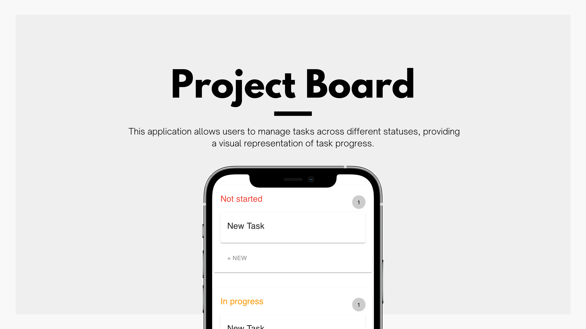
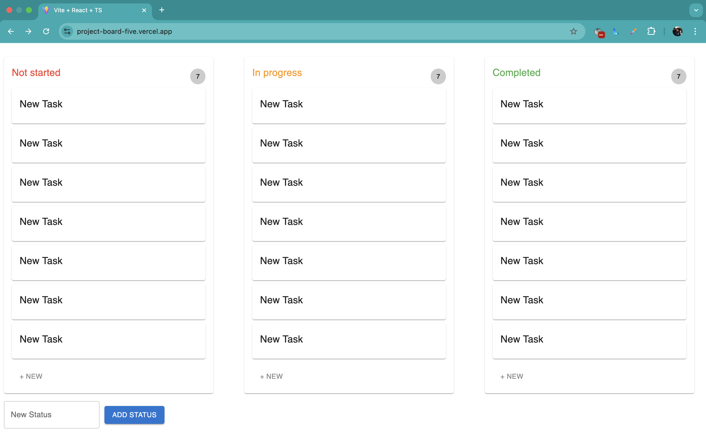
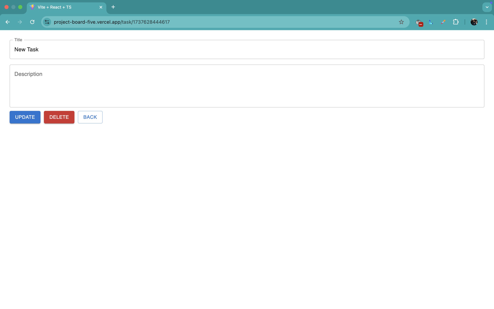
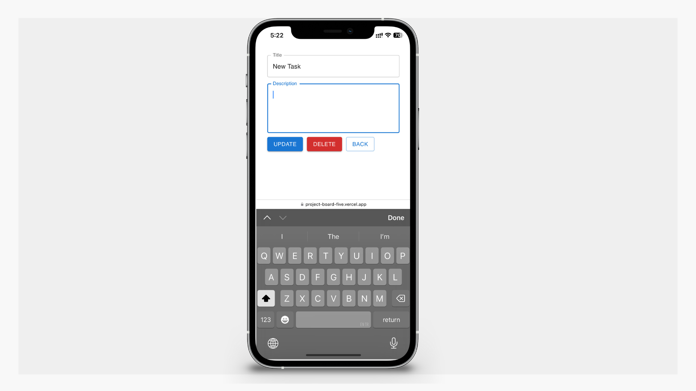
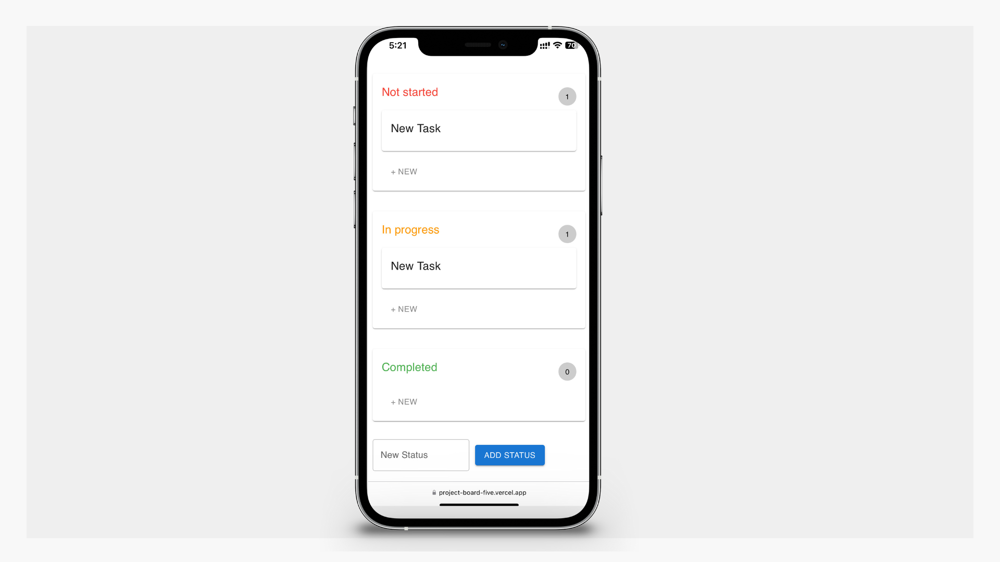

# Project Board Application

A simple project board application built with React and Material UI. This application allows users to manage tasks across different statuses, providing a visual representation of task progress.

## Live Demo

This project is hosted on Vercel. You can view the live demo here: [Project Board Application](https://project-board-five.vercel.app/)

## Screenshot

  

  
  

  

  
  

## Features

- Create, update, and delete tasks.
- Drag and drop functionality to move tasks between different statuses.
- Responsive design for both desktop and mobile views.
- Persistent data storage using local storage.

## Technologies Used

- **React**: A JavaScript library for building user interfaces.
- **Material UI**: A popular React UI framework that implements Google's Material Design.
- **react-beautiful-dnd**: A library for drag-and-drop functionality in React applications.

## Usage

1. **Adding a New Status**: Enter a new status name in the input field and click "Add Status."
2. **Creating Tasks**: Click the "+ New" button under any status to create a new task.
3. **Dragging Tasks**: Drag and drop tasks between statuses to update their progress.
4. **Updating Tasks**: Click on a task to edit its details.
5. **Deleting Tasks**: You can delete tasks as needed.
